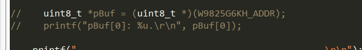

# Bootloader

Board：STM32H750_ArtPi

Function Implementation：在 ArtPi 的环境下，实现一个简单的 BootLoader，该 BootLoader 实现了 QSPI 和 SDRAM  功能的初始化，使 App 可以运行在 QSPI 中，并且可以将 SDRAM 当做普通的内部 RAM 使用（但需要注意，仍需要添加 `SCB_InvalidateDCache` 和 `SCB_CleanDCache` 等函数来更新缓存，类似于对 AXI SRAM 的操作）。

SDRAM 配置参考：[STM32H750XB-Learning/SDRAM_Config (github.com)](https://github.com/STM32H750XB-Learning/SDRAM_Config)

MPU配置参考：[STM32H750XB-Learning/MPU_Cache_Config (github.com)](https://github.com/STM32H750XB-Learning/MPU_Cache_Config)

App代码：[STM32H750XB-Learning/App: Applicaiton Temp For STM32H750 (github.com)](https://github.com/STM32H750XB-Learning/App)

BootLoader代码：[STM32H750XB-Learning/Bootloader (github.com)](https://github.com/STM32H750XB-Learning/Bootloader)

BootLoader和App实现教程：安富莱\_STM32-V7开发板_用户手册，含BSP驱动包设计（V3.5）

# 注意事项

1. 在 BootLoader 中进行了 MPU 的配置，在 App 中，就无需重复配置；
2. 在 BootLoader 中，最好禁用 I-Cache 和 D-Cache（实际上，我看了一下硬汉的部分代码，实际上，并不强求一定要禁用 I-Cache 和 D-Cache，应该还是根据自己的需求来决定是开启还是关闭）；
3. 在 BootLoader 中，配置了 FMC，在 App 中，需要注释以下这段代码：

```c
  /*
   * Disable the FMC bank1 (enabled after reset).
   * This, prevents CPU speculation access on this bank which blocks the use of FMC during
   * 24us. During this time the others FMC master (such as LTDC) cannot use it!
   */
//  FMC_Bank1_R->BTCR[0] = 0x000030D2;
```


此段代码位于 `system_stm32h7xx.h` 中，在进入 `main` 函数前执行，因此在 `main` 函数中进行 `Debug` 可能无法发现此问题。（群友发现的问题）

此寄存器地址为 `0x52004000`，对应 SRAM/NOR-Flash 片选控制寄存器 1（`FMC_BCR1`）。

```c
#define PERIPH_BASE               (0x40000000UL) /*!< Base address of : AHB/APB Peripherals       */

#define D1_AHB1PERIPH_BASE       (PERIPH_BASE + 0x12000000UL)

#define FMC_R_BASE            (D1_AHB1PERIPH_BASE + 0x4000UL)

/*!< FMC Banks registers base  address */
#define FMC_Bank1_R_BASE      (FMC_R_BASE + 0x0000UL)

#define FMC_Bank1_R           ((FMC_Bank1_TypeDef *) FMC_Bank1_R_BASE)
```


`FMC_BCR1 = 0x000030D2;` 的作用可以参考 RM0433 22.7.6 节，我们主要关注以下内容：

- `FMCEN = 0`：禁止 FMC 控制器，`FMC_BCR2..4` 寄存器的 `FMCEN` 位为“无关”位，**只能通过 `FMC_BCR1` 寄存器使能** ；

在未注释此行代码时，FMC Bank1会被关闭（复位后启用），阻止 $24 \mu s$ 内的 FMC 的使用，这会导致 MemMange 错误，导致程序进入 `MemMange_Handler`（可能会被误认为是 BootLoader 未成功跳转，但其实是跳转了，然后立即产生总线错误）。有趣的是，如果在 `BootLoader` 内，对 SDRAM 进行一次读或写操作，则不会产生该报警错误。

<center><b>未进行读写操作，App 进入 MemMange_Handler</b></center>




<center><b>进行读写操作，App 不进入MemMange_Handler</b></center>


4. 在完成以上配置后，就可以在 App 中，像内置 RAM 一样使用 SDRAM。

   - 先在 LinkerScript 内添加以下内容（`UNINIT` 确保该内存区域不会被初始化为 `0`）：

   ```
   RW_IRAM7 0xC0000000 UNINIT 0x02000000  {  ; RW data - 32MB SDRAM(0xC0000000)
   	*(.RAM_SDRAM)
   }
   ```

   - 使用如下：

   ```c
   uint32_t testValue __attribute__((section(".RAM_SDRAM")));
   ```

